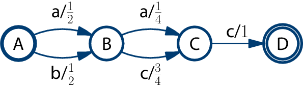

# Flipsta library

The Flipsta library is a fledgling C++ library for manipulation finite-state automata.
Finite-state automata look like this:

[The documentation of the library is here](http://mi.eng.cam.ac.uk/~rcv25/code-documentation/flipsta/).

Branch | Build/test | Test coverage
-------|------------|--------------
master |  | 

## Using the Flipsta library

For more details, see the [documentation](http://mi.eng.cam.ac.uk/~rcv25/code-documentation/flipsta/flipsta/using.html).

However, not that you want to clone *not* this repository, but the `flipsta-build`, which contains this repository and its dependencies as submodules:

    git clone https://github.com/rogiervd/flipsta-build.git
    cd flipsta-build/
    git submodule init
    git submodule update

Then, try to build it:

    bjam
    bjam test

And, most likely, [find out how to fix what has gone wrong](http://mi.eng.cam.ac.uk/~rcv25/code-documentation/flipsta/flipsta/using.html#building-the-library).

## License

The Flipsta library is licensed under the Apache License, Version 2.0.

## Acknowledgements

Development of this library was funded by

-   EPSRC Project EP/I006583/1 (Generative Kernels and Score Spaces for Classification of Speech) within the Global Uncertainties Programme;
-   a Google Research Award.

