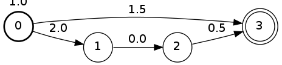

.. _python:

****************
Python interface
****************

.. highlight:: python

Python is a dynamic language, which (unlike C++) is useful for prototyping and for gluing components together.
The Flipsta library provide a Python module to allow both of these.
The Python interface is simpler than the C++ interface and it hides a number of details, so even if you know C++, Python might be a good place to start.

It does use the concept of *labels*, which combine the tuple of symbols and weights that may be familiar from other libraries.
Labels must be in a :ref:`semiring <python_semiring>`.

To understand the interface, it is useful to keep in mind the two different kinds of automata available.

*   A flexible automaton class, ``Automaton``, which can have labels that are Python objects.
    This is flexible but relatively slow — good for prototyping.

*   A range of automata with specific label types.
    These are predefined and compiled into the Python module, so algorithms are fast, but restricted to exactly those types.
    This is useful for computations that can be expressed as standard operations on automata.
    However, this part is not yet implemented.

To use the Python module, make sure the ``PYTHONPATH`` environment variable is set correctly, and in your Python code say::

    import flipsta

All objects are in the ``flipsta`` namespace.

An example automaton, which will be produced in :ref:`the example below <python_example>`:

``Automaton``: a flexible automaton class
=========================================

The most general automaton type is called, appropriately, ``Automaton``.
It has the concepts of states, arcs between states.
The arcs have labels (in a :ref:`semiring <python_semiring>`), which can be weights, symbol sequences, other things, or combinations of those.
The automaton also knows about start and end states (with labels).

.. py:class:: Automaton

    .. py:method:: add_state(state)

        Add a state to the automaton.
        For this automaton type, states must be of type ``int``.
        States must be added before arcs can be added between them.

        For example::

            automaton.add_state (0)
            automaton.add_state (1)
            automaton.add_state (2)
            automaton.add_state (3)

    .. py:method:: has_state(state)

        :return: ``True`` iff the automaton contains a state ``state``.

        For example::

            assert (automaton.has_state (0))
            assert (not automaton.has_state (20))

    .. py:method:: states()

        :return: An iterable with all states that the automaton contains.

        For example::

            assert (list (automaton.states()) == [0, 1, 2, 3])

    .. py:method:: add_arc(source, destination, label)

        Add an arc to the automaton, from state ``source`` to state ``destination``, and with label ``label``.

        For example, assuming that the class ``Cost`` has been defined as in :ref:`the example below <python_semiring>`::

            automaton.add_arc (0, 3, Cost (1.5))

    .. py:method:: arcs_on(forward, state)

        :return:
            An iterable with all arcs (see :py:class:`Arc`) that have ``state`` as a source (if ``forward == True``) or as a destination (if ``forward == False``).

        For example::

            (arc,) = automaton.arcs_on (True, 0)
            assert (arc.state (False) == 0)
            assert (arc.state (True) == 3)
            assert (arc.label() == Cost (1.5))

    .. py:method:: set_terminal_label(start, state, label)

        Set the terminal (start or final) label for state ``state``.
        The start label is set if ``start == True``; the final label if ``start == False``.
        To make ``state`` a start or final state that does not change the label, use ``One`` as the label.
        To remove ``state`` from the list of start or final states, use ``Zero`` as the label.

        For example::

            # Make 0 a start state with cost 1.
            automaton.set_terminal_label (True, 0, Cost (1.))
            # Make 3 a final state with cost 2.
            automaton.set_terminal_label (False, 3, Cost (2.))
            # Remove 1 from the set of start states.
            automaton.set_terminal_label (True, 1, Zero)

    .. py:method:: terminal_label(start, state)

        :return:
            The start label (if ``start == True``) or the final label (if ``start == False``) for state ``state``.
            If ``state`` is not a terminal label, ``Zero`` will be returned.

            For example::

                assert (automaton.terminal_label (True, 0) == Cost (1.))
                assert (automaton.terminal_label (True, 1) == Zero)
                assert (automaton.terminal_label (False, 3) == Cost (2.))

    .. py:method:: terminal_states(start)

        :return:
            An iterable containing all terminal states and their labels.
            The elements of the iterable are tuples: ``(state, label)``.
            This returns the start labels if ``start == True`` or the final labels if ``start == False``.

            For example::

                assert (list (automaton.terminal_states (True)) == [(0, Cost (1.))])
                assert (list (automaton.terminal_states (False)) == [(3, Cost (2.))])

    .. py:method:: shortest_distance_acyclic(initial_states[, bool forward = True])

        Compute the "shortest distance" (the ⊕-sum of labels) over all paths from the states in ``initial_states`` to every other state.

        The automaton must be acyclic, or an exception will be thrown, possibly only while consuming the iterable.

        :param initial_states:
            An iterable with tuples ``(state, label)`` indicating the start labels for the states.

        :param forward:
            Indicate whether to follow the transitions in the forward direction (``forward = True``) or the backward direction (``forward = False``).

        :return:
            An iterable with tuples ``(state, label)``.
            ``label`` is the summed label of all paths from ``initial_states`` to ``state``.

    .. py:method:: shortest_distance_acyclic_from(initial_state[, bool forward = True])

        Compute the "shortest distance" (the ⊕-sum of labels) over all paths from state ``initial_state`` to every other state.

        The automaton must be acyclic, or an exception will be thrown, possibly only while consuming the iterable.

        :param initial_state:
            The initial state.

        :param forward:
            Indicate whether to follow the transitions in the forward direction (``forward = True``) or the backward direction (``forward = False``).

        :return:
            An iterable with tuples ``(state, label)``.
            ``label`` is the summed label of all paths from ``initial_state`` to ``state``.

    .. py:method:: topological_order([bool forward = True])

        :return:
            The states of the automaton in topological order (if ``forward == True``) or reverse topological order (if ``forward == False``).

        The automaton must be acyclic, or an exception will be thrown, possibly only while consuming the iterable.

    .. py:method:: draw(file_name[, bool horizontal = False])

        Output the automaton to a file as a ``.dot`` file.

        Assuming the Graphviz dot is installed, then after writing the textual
        representation to ``automaton.dot``, the following command line will convert it into a PDF file::

            dot -Tpdf automaton.dot -o automaton.pdf

        :param file_name:

            The name of the file to output to, normally ending in ``.dot``.

        :param horizontal:

            Lay levels out horizontally instead of vertically.

.. py:class:: Arc

    Represent an arc (a transition between two states) in an automaton.

    .. py:method:: state(start)

        :return:
            The source state (if ``start == True``) or the destination state (if ``start == False``).

    .. py:method:: label()

        :return: The label on the arc.

.. _python_semiring:

Semirings in Python
-------------------

A `semiring`_ is a mathematical object, similar to a ``class`` in programming languages.
Indeed, implementing a semiring in Python for use as label in an :py:class:`Automaton` typically involves implementing a class.

A semiring defines two operations: ⊕ and ⊗.
In Python, these should be implemented simply as multiplication and addition.
It also defines two base values, 0̅ and 1̅, that when used with ⊕ and ⊗, respectively, do nothing.
They are implemented as special values.

The Python class must support the following:

*   Interaction with special values ``Zero`` and ``One``.
*   Comparing for equality, usually as a method ``__eq__``, and ``__ne__``.
*   Computing the hash value, by providing a method ``__hash__``.
*   Addition, by providing methods ``__add__`` and ``__radd__`` (the latter is always trivial).
*   Multiplication, by providing methods ``__mul__`` and ``__rmul__`` (the latter is sometimes, but not always, trivial).

An example might be helpful.
A useful semiring is one that keeps track of a cost.
Such a semiring is implemented in the Flipsta library as :cpp:class:`math::cost`, but here it will be implemented in Python.
The complete code is in the unit tests, in ``flipsta/test/flipsta-python/cost.py``.

First, import the special values::

    from flipsta import Zero, One

These are capitalised, just like ``None``, to indicate that there is only one value ``Zero`` and one value ``One`` (i.e. they are *singleton objects*).
To interact with them, the new class must often check whether ``other`` is a special object.
`Similar to <https://www.python.org/dev/peps/pep-0008/#programming-recommendations>`_ ``None``, comparison should be performed with ``is``: ``other is Zero``.

Our class will store one value, which is the numerical value of the cost, as a ``float``. ::

    class Cost:
        def __init__ (self, value):
            self.value = float (value)

So how to define multiplication and addition?
Multiplication is used when two arcs are taken after one another; addition when two arcs are alternative paths.
In the case of ``Cost``, when two arcs are taken after one another, the numerical value of the cost should be added.
That is right: the operation ⊗, ``*`` in Python, should be defined as adding the numerical values.
When two arcs are alternative paths, the lowest-cost path should be selected.
Addition should therefore pick the minimum of two costs.
The operation ⊕, ``+`` in Python, should be defined as ``min`` of the numerical values.

A first attempt could look like this::

    def __add__ (self, other):
        # TODO: deal with Zero and One.
        return Cost (min (self.value, other.value))

    def __mul__ (self, other):
        # TODO: deal with Zero and One.
        return Cost (self.value + other.value)

This implementation works if ``other`` is also of type ``Cost``.
However, if ``other`` is ``Zero`` or ``One``, it fails.
The special values need to be dealt with separately.

The meaning of ``Zero`` and ``One``
^^^^^^^^^^^^^^^^^^^^^^^^^^^^^^^^^^^

To deal with ``Zero`` and ``One``, it is important to understand their generalised meaning.
``One`` is the *multiplicative identity*, which means that ``x * One`` must be equal to ``x`` for any ``x`` in the semiring.
Similarly, ``Zero`` is the *additive identity*, which means that ``x + Zero`` must be equal to ``x``.
The other special property of ``Zero`` is that it is the *multiplicative annihilator*.
That means that ``x * Zero`` must be equal to ``Zero``.

It is now already possible to start writing the unit test::

    # Test the interaction with Zero and One.
    examples = [-2.5, -1, 0, +0.5, 3, float ('+inf')]
    for cost in [Cost (value) for value in examples]:
        assert (cost == cost * One == cost)
        assert (cost == One * cost == cost)

        assert (cost == cost + Zero == cost)
        assert (cost == Zero + cost == cost)

        assert (Zero == cost * Zero == Zero)
        assert (Zero == Zero * cost == Zero)

So what values should be equivalent to ``Zero`` and ``One``?
For ``Zero``, a value is required so that ``x + Zero == x``.
``+`` is defined as taking the minimum of two values.
``Cost(∞)``, written in Python as ``Cost(float('inf'))``, will therefore be equivalent to ``Zero``.
The value equivalent to ``One`` should be such that ``x * One == x``.
Since multiplication of Cost add numerical value, ``Cost(0)`` will fulfil this requirement.

The unit test can therefore be augmented with::

    assert (Cost (float ('inf')) == Zero)
    assert (Zero == Cost (float ('inf')))
    assert (Cost (0) == One)
    assert (One == Cost (0))

    assert (hash (Cost (float ('inf'))) == hash (Zero))
    assert (hash (Cost (0)) == hash (One))

Note that we are also testing ``hash``.
To be able to use our semiring in hashed collections, in Python and C++, `the hash value must be equal for two values that are equal <https://docs.python.org/3/reference/datamodel.html#object.__hash__>`_.

Defining operations
^^^^^^^^^^^^^^^^^^^

Testing for equality simply compares the numerical values, but treating ``One`` and ``Zero`` explicitly::

    def __eq__ (self, other):
        if other is Zero:
            return self.value == float ('inf')
        elif other is One:
            return self.value == 0
        else:
            return self.value == other.value

    def __ne__ (self, other):
        return not self == other

Note the explicit checks ``is Zero`` and ``is One``: these will come up again.

``__hash__`` should compute a hash value, an integer that is equal for values that are equal, and with high probability not equal for values that are not equal.
Since, again, our class should be interoperable with ``Zero`` and ``One``, they need to be treated explicitly.
We need to make sure that ``hash (Cost (0))`` yields exactly the same value as ``hash (One)``, and similar for ``Zero``::

    def __hash__ (self):
        if self.value == 0:
            return hash (One)
        elif self.value == float ('inf'):
            return hash (Zero)
        else:
            return hash (self.value)

Note that ``hash (One)`` and ``hash (Zero)`` will return different values between separate invocations of Python.

Addition should choose the minimum of the two values.
But it should also deal with ``Zero`` and ``One``::

    def __add__ (self, other):
        if other is Zero:
            return self
        elif other is One:
            return Cost (min (self.value, 0))
        else:
            return Cost (min (self.value, other.value))

This defines the behaviour of ``x + One``.
To make sure the behaviour of ``One + x`` is also correct, Python allows us to write the ``__radd__`` method.
Addition is used when two arcs go into the same state, and the order of the arcs should not make a difference.
Addition must therefore be *commutative* (this can also be checked on the Wikipedia page for `semiring`_).
This means that our implementation of ``__radd__`` can just forward to ``__add__``::

    def __radd__ (self, other):
        return self + other

Multiplication is used when two transitions are taken after one another.
For the ``Cost`` semiring, the costs should be added.
The special values, again, must be dealt with too::

        def __mul__ (self, other):
            if other is Zero:
                return Cost (float ('inf'))
            elif other is One:
                return self
            else:
                return Cost (self.value + other.value)

This defines the behaviour of ``x * One``.
To define ``One * x``, ``__rmul__`` should be defined.
In general, multiplication is not commutative, because taking one arc after another is different from taking the other after the one.
For example, in a sequence semiring multiplication might concatenate two sequences.
[a b] ⊗ [c d] should be [a b c d] and not [c d a b].
However, in the case of the ``Cost`` semiring, multiplication happens to be commutative, so that it is possible to write::

    def __rmul__ (self, other):
        return self * other

When drawing automata and while debugging, it is useful to have an informative textual representation of the semiring.
In this case, that is easy::

    def __str__ (self):
        return str (self.value)

.. _python_example:

Using the semiring
^^^^^^^^^^^^^^^^^^

To test the semiring, a small automaton can be produced::

    automaton = flipsta.Automaton()

    automaton.add_state ('start')
    automaton.add_state (1)
    automaton.add_state ('two')
    automaton.add_state (3)

    automaton.add_arc ('start', 1, Cost (2.))
    automaton.add_arc (1, 'two', Cost (0.))
    automaton.add_arc ('two', 3, Cost (.5))
    automaton.add_arc ('start', 3, Cost (1.5))

    automaton.set_terminal_label (True, 'start', Cost (1.))
    automaton.set_terminal_label (False, 3, Cost (2.))

This can be drawn::

    make_automaton().draw ("./automaton.dot", True)

and then on the command line::

    dot -Tpdf automaton.dot -o automaton.pdf

It is now possible, for example, to compute the shortest distance from state ``0`` to every other state::

    distances = list (make_automaton().shortest_distance_acyclic_from ("start"))
    assert (len (distances) == 4)
    assert (distances [0] == ('start', Cost (0)))
    assert (distances [1] == (1, Cost (2.)))
    assert (distances [2] == ('two', Cost (2.)))
    assert (distances [3] == (3, Cost (1.5)))

.. _semiring: http://en.wikipedia.org/wiki/Semiring
